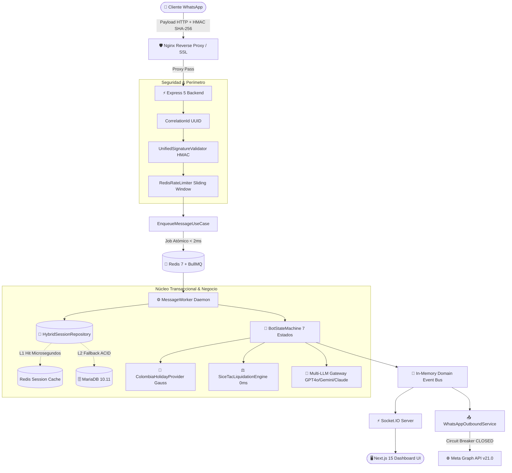

<div align="center">

# 💬 ChatBot Modulo Saludo — Enterprise WhatsApp Platform
### *Plataforma Inteligente de Captación Comercial, Motor FSM Conversacional y Liquidación Oficial SICE-TAC*

[](https://nodejs.org)
[](https://www.typescriptlang.org)
[](https://nextjs.org)
[](https://expressjs.com)
[](https://www.docker.com)
[](https://mariadb.org)
[](https://redis.io)
[](https://jestjs.io)
[](https://github.com/MaciasSM2/Chatbot-V1)

<p align="center">
  <b>Solución Fullstack Cloud-Native de Marca Blanca para Empresas de Transporte de Carga Terrestre y Logística en Colombia.</b><br>
  Automatiza el ciclo completo: saludo contextual, captura de identidad (Habeas Data), liquidación legal de fletes en milisegundos y atención híbrida con IA.
</p>

[Resumen Ejecutivo](#-resumen-ejecutivo-en-30-segundos) •
[Arquitectura](#-arquitectura-técnica-del-sistema) •
[Stack](#-stack-tecnológico) •
[Inicio Rápido](#-inicio-rápido-quickstart) •
[Documentación](#-suite-de-documentación-completa) •
[Catálogo de APIs](#-catálogo-de-endpoints-de-la-api-rest) •
[Roadmap](#-matriz-estratégica-de-sugerencias-tres-pilares)

---

</div>

## 🌟 Resumen Ejecutivo en 30 Segundos

### ¿Qué problema resolvemos?
En el sector de transporte de carga pesada en Colombia, **el 70% de los clientes cotizan con varias empresas al mismo tiempo** por WhatsApp. Las respuestas humanas tardan entre 15 minutos y 4 horas. Además, liquidar manualmente las tarifas reguladas por el Ministerio de Transporte (**SICE-TAC**) genera constantes errores de cobro o multas regulatorias.

### ¿Cómo lo soluciona esta plataforma?
1. **Atención Instantánea (< 1s)**: Saluda al cliente, detecta festivos de Colombia (Ley Emiliani / Algoritmo de Gauss) y responde las 24 horas del día.
2. **Cumplimiento Legal (Habeas Data)**: Captura y cifra la identificación del cliente con estándar bancario (**AES-256-GCM**).
3. **Liquidación Determinista SICE-TAC**: Calcula en tiempo real el flete oficial exacto según origen, destino, peso y tipo de camión (0% margen de error / 0% alucinaciones).
4. **Dashboard y CRM en Vivo**: El equipo operativo visualiza las cotizaciones en tiempo real mediante **WebSockets** y exporta métricas a Excel/PDF.
5. **Asistente Multimodelo con IA**: Soporta **OpenAI GPT-4o**, **Google Gemini 1.5** y **Anthropic Claude 3.5** para responder dudas libres de la compañía.

```text
[ Cliente en WhatsApp ] ──► [ Saludo + Festivo ] ──► [ Captura Cédula ] ──► [ Flete SICE-TAC ] ──► [ Dashboard CRM ]
```

---

## 📐 Arquitectura Técnica del Sistema

Diseñada bajo **Clean Architecture**, **Domain-Driven Design (DDD)** y desacoplamiento asíncrono de eventos:



---

## 🏗️ Stack Tecnológico

| Capa | Tecnologías | Propósito e Impacto de Ingeniería |
|---|---|---|
| **Frontend UI** | **Next.js 15 (App Router)**, React 19, Tailwind CSS 4, Zustand 5, Recharts, Lucide | Dashboard administrativo en tiempo real, CRM de clientes, simulador multimotor y exportación de reportes. |
| **Backend Core** | **Node.js 20+**, **TypeScript 5.7**, **Express 5**, Contenedor IoC nativo | Orquestación conversacional, pipeline de middlewares perimetrales, validación estricta con Zod y endpoints REST. |
| **Colas & Asincronía** | **BullMQ 5**, **Redis 7.2** | Desacoplamiento de recepción de webhooks (< 2ms) y procesamiento resiliente en segundo plano. |
| **Persistencia Híbrida** | **MariaDB 10.11** + **Redis 7** | Almacenamiento transaccional ACID (InnoDB) combinado con caché ultrarrápida de sesiones en microsegundos. |
| **Tiempo Real** | **Socket.IO 4.8** | Emisión bidireccional de eventos `new_message`, `session_updated` y telemetría al Dashboard. |
| **Inteligencia Artificial** | **OpenAI GPT-4o**, **Gemini 1.5**, **Claude 3.5**, **Qdrant Vector DB** | Pasarela multimodelo para consultas libres y base de datos vectorial para búsqueda semántica RAG. |
| **Ciberseguridad** | **HMAC SHA-256**, **AES-256-GCM**, **Zod**, Cookies HttpOnly | Blindaje de webhooks con `timingSafeEqual`, cifrado de datos personales (Habeas Data) y filtro anti-inyección de prompts. |
| **Observabilidad** | **Prometheus**, **Grafana 10**, **Winston** (Logs con UUID) | Métricas de rendimiento, latencia percentil p95, estado de colas y trazabilidad transaccional. |
| **Infraestructura** | **Docker Compose**, **Nginx Proxy**, **Helm Charts (K8s)** | Aislamiento en red privada bridge, terminación SSL/TLS y despliegue cloud-native escalable. |

---

## ⚡ Inicio Rápido (Quickstart)

### 1. Requisitos Previos
- **Docker** & **Docker Compose** (Recomendado para producción)
- **Node.js >= 20.x** & **npm >= 10.x** (Para desarrollo local)

---

### 2. Despliegue con Docker Compose (1 solo comando)

```bash
# 1. Clonar el repositorio
git clone https://github.com/MaciasSM2/Chatbot-V1.git
cd Chatbot-V1

# 2. Configurar variables de entorno
cp .env.docker.example .env

# 3. Levantar todo el stack en background
docker compose up -d --build

# 4. Verificar salud del clúster
curl http://localhost/health
```

- **Dashboard Web**: [http://localhost](http://localhost) (o puerto `3015`)
- **API Backend**: [http://localhost/api](http://localhost/api) (o puerto `3014`)

---

### 3. Ejecución en Desarrollo Local

```bash
# Instalar dependencias del monorepo
npm install

# Iniciar Backend (Puerto 3014)
npm run dev:backend

# Iniciar Dashboard (Puerto 3015)
npm run dev:dashboard
```

---

## 🧪 Calidad de Software y Testing

El repositorio cuenta con una suite rigurosa de **14 suites de prueba** y **61 tests unitarios e integrados**:

```bash
# Ejecutar suite de pruebas completa
npm test

# Compilación TypeScript en todo el monorepo
npm run build
```

---

## 📚 Suite de Documentación Completa

Toda la documentación técnica y de negocio está organizada jerárquicamente en [`docs/`](./docs):

```text
docs/
├── 💼 business/                         # Módulo Ejecutivo y Estrategia de Negocio
│   ├── RESUMEN_EJECUTIVO.md             # Propuesta de valor, ROI y flujo de usuario para clientes
│   ├── PITCH_SUSTENTACION.md            # Guía estructurada para presentación oral de 10 minutos
│   ├── DEFENSA_TECNICA.md               # Banco de preguntas tácticas ante jurados y auditores
│   └── GUIA_REGULATORIA_SICE_TAC.md     # Resolución 20213040034345 y algoritmo matemático de fletes
│
├── 🏛️ architecture/                     # Módulo de Arquitectura e Ingeniería
│   ├── ARQUITECTURA_SISTEMA.md          # Clean Architecture, Inversión de Control (IoC) y persistencia híbrida
│   ├── FLUJO_DATOS_END_TO_END.md        # Tubería asíncrona BullMQ y ciclo de vida del mensaje
│   ├── MAQUINA_ESTADOS_FSM.md           # Detalle de los 7 estados deterministas y transiciones
│   └── SEGURIDAD_Y_RESILIENCIA.md       # Cifrado AES-256-GCM, HMAC SHA-256, Rate Limiting y Circuit Breaker
│
├── 🚀 operations/                       # Módulo de Despliegue y Mantenimiento
│   ├── GUIA_DESPLIEGUE.md               # Despliegue con Docker Compose, Nginx SSL y Helm para Kubernetes
│   ├── META_WHATSAPP_SETUP.md           # Vinculación con Meta Developers, webhooks y tokens permanentes
│   ├── MONITOREO_Y_TELEMETRIA.md        # Métricas Prometheus, paneles Grafana y Correlation IDs
│   └── RUNBOOK_RECUPERACION.md          # Procedimientos de mitigación de incidentes y contingencias
│
└── 📡 api/                              # Módulo de Referencia de API
    └── API_REFERENCE.md                 # Catálogo exhaustivo de endpoints REST y eventos WebSocket
```

---

## 📌 Catálogo de Endpoints de la API REST

| Método | Endpoint | Descripción | Autenticación |
|---|---|---|---|
| `GET` | `/health` | Chequeo de vitalidad del sistema (MariaDB, Redis, Circuit Breaker) | Pública |
| `GET` | `/metrics` | Métricas oficiales en formato estándar Prometheus | Pública |
| `GET/POST` | `/api/webhook` | Handshake y recepción de webhooks con firma HMAC de Meta WhatsApp | HMAC SHA-256 |
| `GET` | `/api/greetings` | Listado de plantillas de saludos dinámicos parametrizados | Pública / Admin |
| `GET` | `/api/admin/crm/clients` | Listado de clientes registrados en el CRM | JWT / HttpOnly |
| `POST` | `/api/admin/crm/clients/upload-rut` | Carga binaria y validación de documentos RUT | JWT / HttpOnly |
| `GET` | `/api/admin/settings/brand` | Configuración de marca, tono y prompts de sistema | JWT / HttpOnly |
| `GET` | `/api/admin/queues/stats` | Telemetría en tiempo real de colas BullMQ | JWT / HttpOnly |
| `POST` | `/api/simulator/multi-chat` | Simulación simultánea de los 3 motores conversacionales | Rate Limited (20/min) |

---

## 📊 Matriz Estratégica de Sugerencias (Tres Pilares)

| Pilar | Componente | Vulnerabilidad / Oportunidad | Acción Implementada / Recomendada | Estado |
|---|---|---|---|---|
| 🔐 **Seguridad** | Webhook WhatsApp | Ausencia de filtrado IP para peticiones de Meta | Validación criptográfica de firmas HMAC SHA-256 timing-safe y whitelist de IPs de Meta en Nginx | ✅ Implementado |
| 🔐 **Seguridad** | Datos Sensibles | Riesgo de filtración de documentos de identidad | Cifrado transparente **AES-256-GCM** en repositorio MariaDB (Habeas Data) | ✅ Implementado |
| 🔐 **Seguridad** | Inserción RAG | Riesgo de Prompt Injection en mensajes libres | Cortafuegos heurístico `PromptInjectionGuard` previo a inferencia de LLMs | ✅ Implementado |
| ⚙️ **Función** | Motor Conversacional | Alucinación tarifaria de IAs generativas | Máquina de Estados Finitos (FSM) determinista de 7 estados combinada con IA | ✅ Implementado |
| ⚙️ **Función** | Motor SICE-TAC | Cuello de botella I/O en cálculo de fletes | Estrategia de **Caché Multinivel (L1 Memoria 0ms + L2 Redis + L3 MariaDB)** | ✅ Implementado |
| ⚙️ **Función** | Resiliencia WAN | Caídas externas de la API de Meta | **AdvancedCircuitBreaker** con cola de diferidos y reintento con backoff exponencial | ✅ Implementado |
| 🎨 **Interfaz** | Dashboard Next.js | Desfase visual de cotizaciones entrantes | Integración de **WebSockets (Socket.IO)** para actualización instantánea | ✅ Implementado |
| 🎨 **Interfaz** | Chat Simulator | Dificultad para comparar proveedores de IA | Módulo de **Simulación Multimotor** (FSM vs GPT-4o vs Gemini vs Claude) | ✅ Implementado |

---

## 📄 Licencia

Este proyecto está distribuido bajo la licencia **MIT**. Consulte el archivo `LICENSE` para más información.

<div align="center">
  <sub>Desarrollado con ❤️ y excelencia en ingeniería de software para la industria logística.</sub>
</div>
