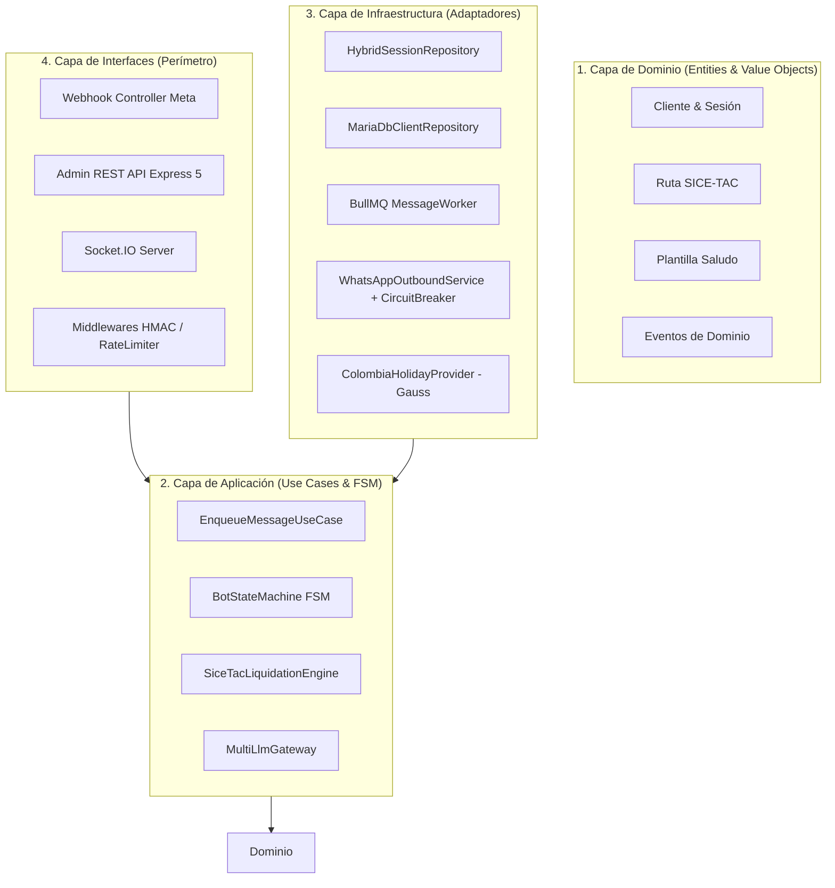

# 🏛️ Arquitectura del Sistema y Principios de Diseño

> **Especificación Técnica de Arquitectura Limpia, Microservicios y Contenedor de Inversión de Control (IoC)**  
> *Versión 2.0.0 — Stack Empresarial Node.js / Express 5 / Next.js 15 / MariaDB / Redis*

---

## 📐 1. Visión General y Patrón Arquitectónico

La plataforma está diseñada bajo los principios de **Clean Architecture (Arquitectura Limpia / Hexagonal)** y **Domain-Driven Design (DDD)**, garantizando que las reglas de negocio sean independientes de la infraestructura, bases de datos o frameworks web.



---

## 🧩 2. Contenedor de Inversión de Control (`AppContainer`)

El backend utiliza un contenedor IoC nativo que ensambla los componentes al arrancar la aplicación, garantizando el principio de **Inversión de Dependencias (SOLID - D)**:

- **Singletons Reutilizables**:
  - `MariaDB Pool`: Gestión de conexiones con pool transaccional.
  - `Redis Client`: Conexiones desacopladas para caché (`ioredis`) y colas de trabajo (`BullMQ`).
  - `DomainEventBus`: Despacho asíncrono de eventos internos en memoria.
  - `AdvancedCircuitBreaker`: Guardián de llamadas hacia Meta Graph API v21.0.

---

## 🏢 3. Esquema de Persistencia Híbrida (Redis + MariaDB)

Para satisfacer el requerimiento de alta velocidad en mensajería sin comprometer la integridad financiera:

| Dimensión | Capa de Memoria (Redis 7) | Capa Relacional (MariaDB 10.11) |
|---|---|---|
| **Propósito** | Sesiones activas de chat, tokens, rate-limiting y colas BullMQ | Clientes CRM, historial de cotizaciones, festivos y logs de auditoría |
| **Tiempo de Acceso** | **< 1 milisegundo (Microsegundos)** | **1–5 milisegundos (Indexado)** |
| **Persistencia** | Snapshots RDB + Append-Only File (AOF) | Transacciones ACID, motor InnoDB, llaves foráneas |
| **Estrategia** | Write-Through con TTL automático (24 horas) | Cache-Aside de rehidratación |

```text
[ Consulta de Sesión del Usuario ]
               │
               ▼
      ¿Existe en Redis? ──────── (SI: 0.2ms) ──────► Retornar estado
               │ (NO / Fallo)
               ▼
    Consultar en MariaDB ─────── (Hit SQL) ───────► Rehidratar Redis y Retornar
               │ (NO)
               ▼
     Crear Nueva Sesión
```

---

## 🌐 4. Monorepo y Estructura Modular

El proyecto está organizado como un **Monorepo con Workspaces de npm**:

```text
ChatBot-Modulo-Saludo/
├── whatsapp-backend/          # Núcleo de API REST, FSM, Colas y Conexiones
│   ├── src/
│   │   ├── config/            # Variables de entorno validadas con Zod
│   │   ├── core/              # Entidades de dominio, Casos de uso y FSM
│   │   ├── infrastructure/    # Adaptadores MariaDB, Redis, BullMQ, Logger
│   │   ├── interfaces/        # Controladores HTTP Express 5 y Middlewares
│   │   ├── providers/         # Clientes IA (OpenAI, Gemini, Anthropic)
│   │   └── tests/             # 14 Suites de pruebas unitarias e integración
├── whatsapp-dashboard/        # Panel web Next.js 15 (App Router)
│   ├── src/
│   │   ├── app/               # Rutas de interfaz (Inicio, CRM, Saludos, etc.)
│   │   ├── components/        # Componentes UI con Tailwind CSS 4
│   │   ├── hooks/             # SWR y WebSockets Socket.IO en tiempo real
│   │   └── stores/            # Estados globales con Zustand 5
├── docs/                      # Suite completa de documentación técnica y negocio
├── nginx/                     # Configuración de proxy reverso con SSL
├── prometheus/                # Configuración de scraping de métricas
└── grafana/                   # Dashboards preconfigurados de telemetría
```
