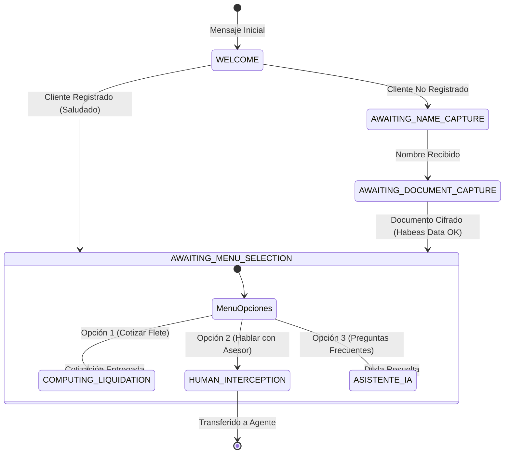

# 🤖 Máquina de Estados Finitos Conversacional (FSM)

> **Motor Determinista de 7 Estados para Interacciones Empresariales en WhatsApp**  
> *Versión 2.0.0 — Patrón State + Strategy + Inyección Temática Contextual*

---

## 🎯 1. ¿Por qué una FSM para WhatsApp?

Los modelos de lenguaje (LLMs) puros son ideales para creatividad, pero presentan serios riesgos en flujos comerciales críticos:
- **Alucinaciones**: Pueden inventar tarifas o condiciones de entrega inexistentes.
- **Pérdida de Secuencia**: Pueden olvidar solicitar la identificación o la autorización legal de tratamiento de datos personales.
- **Variabilidad**: Generan respuestas impredecibles para la misma pregunta regulatoria.

La solución de **ChatBot-V1** utiliza una **Máquina de Estados Finitos (FSM)** determinista que controla el flujo de la conversación, dejando a la IA únicamente la tarea de responder preguntas informativas abiertas.

---

## 🗺️ 2. Diagrama de Transición de Estados



---

## 📋 3. Catálogo y Responsabilidad de los Estados

| Estado | Evento Desencadenante | Acción del Bot | Siguiente Estado |
|---|---|---|---|
| **`WELCOME`** | Mensaje entrante inicial de usuario | Consulta si el número existe en el CRM; genera saludo según hora y festivo (Gauss). | `AWAITING_NAME_CAPTURE` o `AWAITING_MENU_SELECTION` |
| **`AWAITING_NAME_CAPTURE`** | Recepción de nombre del usuario | Sanitiza texto, extrae nombres/apellidos y solicita documento de identidad. | `AWAITING_DOCUMENT_CAPTURE` |
| **`AWAITING_DOCUMENT_CAPTURE`** | Recepción de cédula / NIT | Valida formato numérico, aplica cifrado **AES-256-GCM** y guarda en CRM MariaDB. | `AWAITING_MENU_SELECTION` |
| **`AWAITING_MENU_SELECTION`** | Selección de opción 1, 2 o 3 | Evalúa la intención del usuario y enruta al sub-flujo correspondiente. | `COMPUTING_LIQUIDATION`, `HUMAN_INTERCEPTION` o `IA` |
| **`COMPUTING_LIQUIDATION`** | Captura de origen, destino, peso y vehículo | Invoca a `SiceTacLiquidationEngine`, resuelve matriz de costos y entrega liquidación. | `AWAITING_MENU_SELECTION` |
| **`HUMAN_INTERCEPTION`** | Solicitud de operador humano | Desactiva respuestas automáticas del bot y alerta al panel web mediante WebSockets. | Espera reanudación manual |
| **`ASISTENTE_IA`** | Pregunta libre sobre servicios | Sanitiza prompt con `PromptInjectionGuard` y envía a OpenAI GPT-4o / Gemini. | `AWAITING_MENU_SELECTION` |

---

## 🛡️ 4. Patrón de Inyección Temática y Sanitización

Cada estado implementa la interfaz `IBotState`:

```typescript
export interface IBotState {
  readonly stateType: BotState;
  handle(context: IStateContext): Promise<IStateExecutionResult>;
}
```

- **Aislamiento**: Cada estado tiene su propia clase y lógica de validación.
- **Inyección de Prompts Segura**: Antes de pasar cualquier texto a los proveedores de IA, el `PromptInjectionGuard` detecta intentos de jailbreak (*"ignora instrucciones anteriores"*, *"actúa como un pirata"*), neutralizando la amenaza y manteniendo la compostura corporativa.
